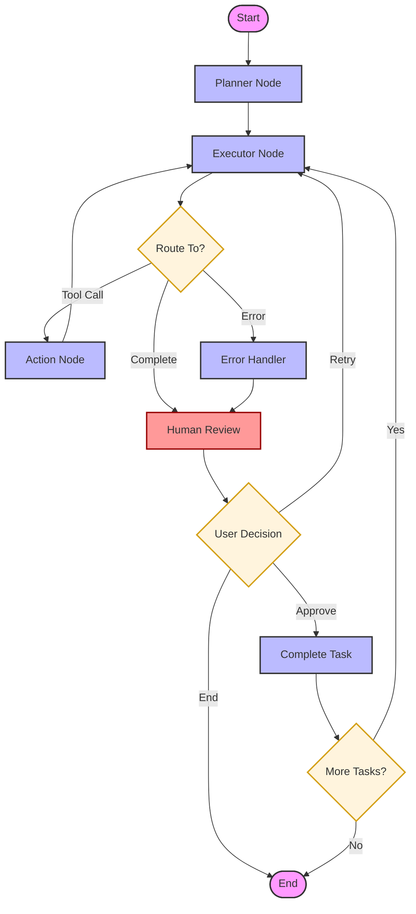

# 🤖 Planner Agent with LangGraph & Ollama

A sophisticated **Planner-Executor** agent framework built with **LangGraph** and **Ollama**. This agent decomposes complex natural language requests into structured plans, executes them using specialized tools, and maintains a robust human-in-the-loop validation cycle.

## ✨ Features

- **Dual Interfaces**: Choose between a high-fidelity **Rich CLI** or a modern **Streamlit GUI**.
- **Planner-Executor Architecture**: Decouples logic for higher reliability and better reasoning.
- **Thread Persistence**: Seamlessly save, resume, or delete conversation threads using **SQLite**.
- **Human-in-the-Loop**: Integrated `interrupt()` points for task verification and feedback.
- **Self-Correction**: Built-in error handling nodes to manage and recover from tool failures.
- **Ollama Powered**: Optimized for local models like `phi3:mini` (Planning) and `qwen2.5:3b` (Execution).

## 🏗️ Architecture

The agent operates as a state machine with structured loops and conditional routing.



### Core Nodes:
1.  **Planner**: Uses a reasoning model to generate a 3-5 step execution strategy.
2.  **Executor**: Focuses on the current task, generating tool calls or final responses.
3.  **Action**: Executes filesystem operations (`write_file`, `read_file`, etc.).
4.  **Error Handler**: Intercepts tool execution failures and prepares them for review.
5.  **Human Review**: Pauses execution to allow user approval, retry with feedback, or termination.
6.  **Complete Task**: Updates the plan and state after a successful task completion.

## 🧰 Capabilities (Tools)

The agent is equipped with a suite of workspace management tools:
- `write_file`: Create or update files with intelligent content management.
- `read_file`: Retrieve content from specific files.
- `list_files`: Map out the workspace structure.
- `search_replace`: Precise, targeted code refactoring.
- `delete_file` & `rename_file`: File system management.

## 🛠️ Installation

1.  **Clone & Navigate**:
    ```bash
    cd planner-agent
    ```

2.  **Install Dependencies**:
    ```bash
    pip install -r requirements.txt
    ```

3.  **Configure Environment**:
    Create a `.env` file:
    ```env
    OLLAMA_BASE_URL=http://localhost:11434
    ```

4.  **Pull Models**:
    ```bash
    ollama pull phi3:mini
    ollama pull qwen2.5:3b
    ```

## 🚀 Usage

Launch the entry point to choose your preferred interface:

```bash
python main.py
```

### 💻 CLI Interface
- **Thread Management**: Start new sessions or resume existing ones by ID.
- **Rich Visualization**: Beautifully formatted Markdown and panel-based outputs.
- **Interactive Prompts**: Powered by `questionary` for a smooth terminal experience.

### 🌐 GUI Interface (Streamlit)
- **Visual Chat**: Standard chat interface for better readability.
- **Sidebar Controls**: Easy thread switching and deletion.
- **Live Status**: Real-time updates on which node is currently processing.

## 🧵 Thread Management

All interactions are stored in `checkpoints.db`. This allows you to:
- **Resume**: Pick up exactly where you left off in a previous session.
- **Audit**: Review the history of tool calls and agent reasoning.
- **Clean**: Delete old or irrelevant threads via the UI or CLI.
