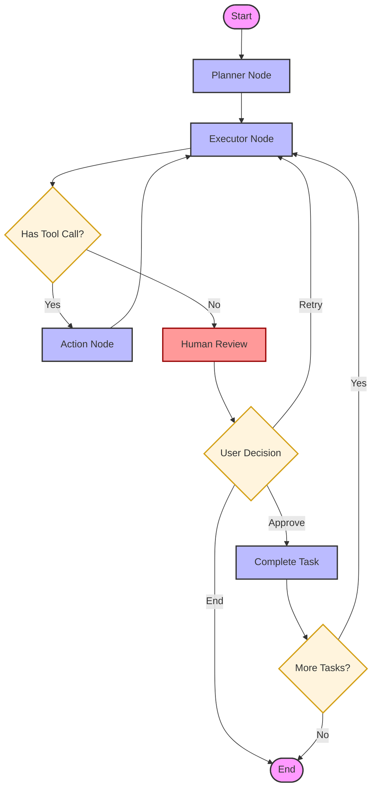

# Planner Agent with LangGraph & Ollama

This is a powerful **Planner-Executor** agent built with **LangGraph** and **Ollama**. It breaks down complex user requests into actionable tasks, executes them using tools, and includes a human-in-the-loop review step for verification.

## 🚀 Features

- **Planner-Executor Architecture**: Separates task planning from execution for better reliability.
- **Human-in-the-loop**: Pauses for user approval after every task.
- **Ollama Integration**: Uses `phi3:mini` for planning and `qwen2.5:3b` for tool execution.
- **Rich CLI**: A beautiful terminal interface using the `rich` library.
- **State Persistence**: Uses `MemorySaver` to maintain thread state and handle interrupts.

## 🏗️ Graph Schema

The agent operates as a state machine with a structured loop and human-in-the-loop validation.



### Nodes:
1.  **Planner**: Analyzes user input and generates a concise 3-5 step plan.
2.  **Executor**: Focuses on the current task, generating tool calls or responses.
3.  **Action**: Executes filesystem tools (`write_file`, `read_file`, `list_files`).
4.  **Human Review**: Uses `interrupt()` to pause and wait for user feedback.
5.  **Complete Task**: Moves the finished task to the completed list and updates the plan.

## 🧰 Tools

The agent has access to a variety of filesystem and refactoring tools:
- **`write_file`**: Create a file or append to it if it already exists.
- **`read_file`**: Read the contents of a file.
- **`list_files`**: List files in the workspace.
- **`search_replace`**: Perform targeted text replacement within a file.
- **`rename_file`**: Move or rename a file.
- **`delete_file`**: Remove a file from the workspace.

## 🛠️ Setup

1.  **Install Dependencies**:
    ```bash
    pip install -r requirements.txt
    ```

2.  **Configure Environment**:
    Create a `.env` file in the `planner-agent` directory:
    ```env
    OLLAMA_BASE_URL=http://localhost:11434
    ```

3.  **Run Ollama**:
    Ensure Ollama is running and you have the models:
    ```bash
    ollama pull phi3:mini
    ollama pull qwen2.5:3b
    ```

## 🏃 Usage

Run the agent from the project root:

```bash
python -m planner-agent.main
```

### Human Review Options:
- **approve**: Mark the task as done and move to the next.
- **retry**: Send the task back to the executor (useful if the result wasn't quite right).
- **end**: Stop the entire process immediately.
